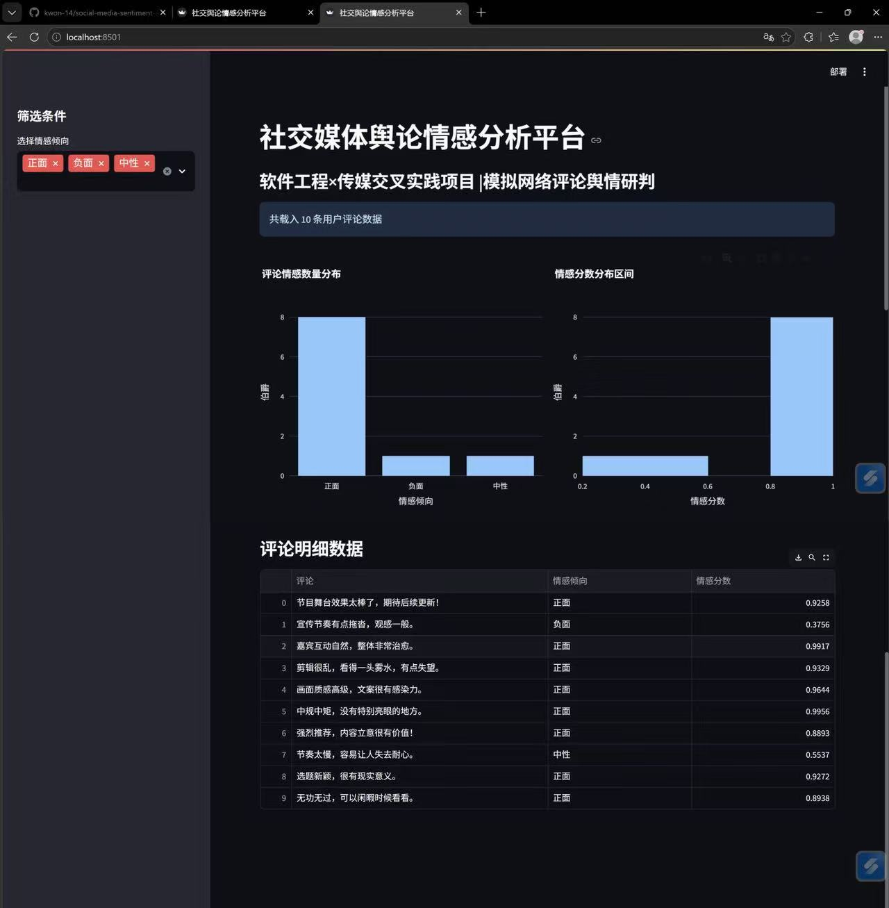

# social-media-sentiment-analysis
Interdisciplinary Project: Social Media Sentiment Analysis for Communication Research
跨学科项目：面向传播学研究的社交媒体情感分析

## Project Introduction
Combining software engineering technology with communication studies, this project builds a social media public opinion sentiment analysis platform.
本项目融合软件工程技术与传播学研究，搭建了一套社交媒体舆情情感分析平台。
Powered by Python, it realizes text sentiment recognition and data visualization.
依托Python技术，实现文本情感识别与数据可视化功能。
It can be applied to variety show promotion, online public opinion monitoring and fan sentiment analysis, assisting practitioners to track public emotional trends.
可应用于综艺宣发、网络舆情监测、粉丝情绪分析等场景，帮助从业者追踪大众情感走向。

## Tech Stack
Python, SnowNLP Sentiment Analysis, Data Visualization
## 技术栈
Python、SnowNLP中文情感分析、数据可视化

## Project Preview

## 项目预览

## Features
- Chinese text sentiment analysis based on SnowNLP
- 基于SnowNLP实现中文文本情感分析
- Visual statistics of sentiment distribution
- 情感分布可视化统计
- Research on simulated social media comment data
- 基于模拟社交媒体评论数据开展研究
